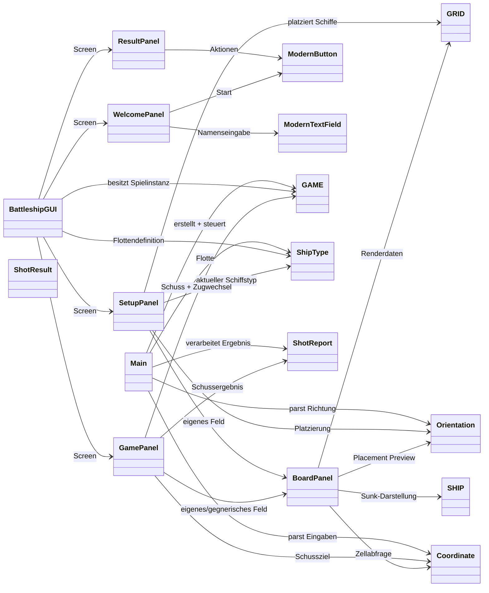
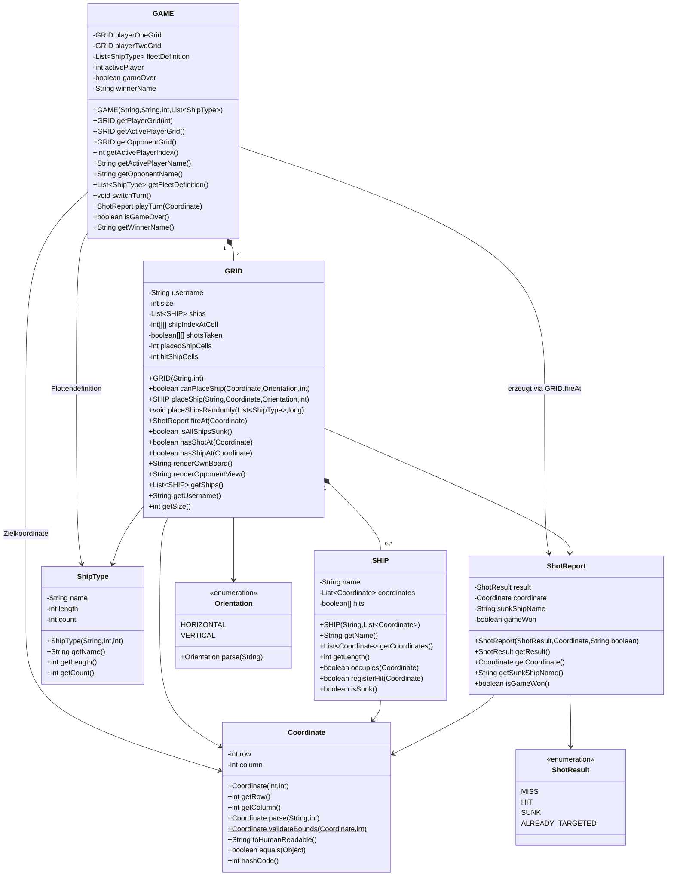
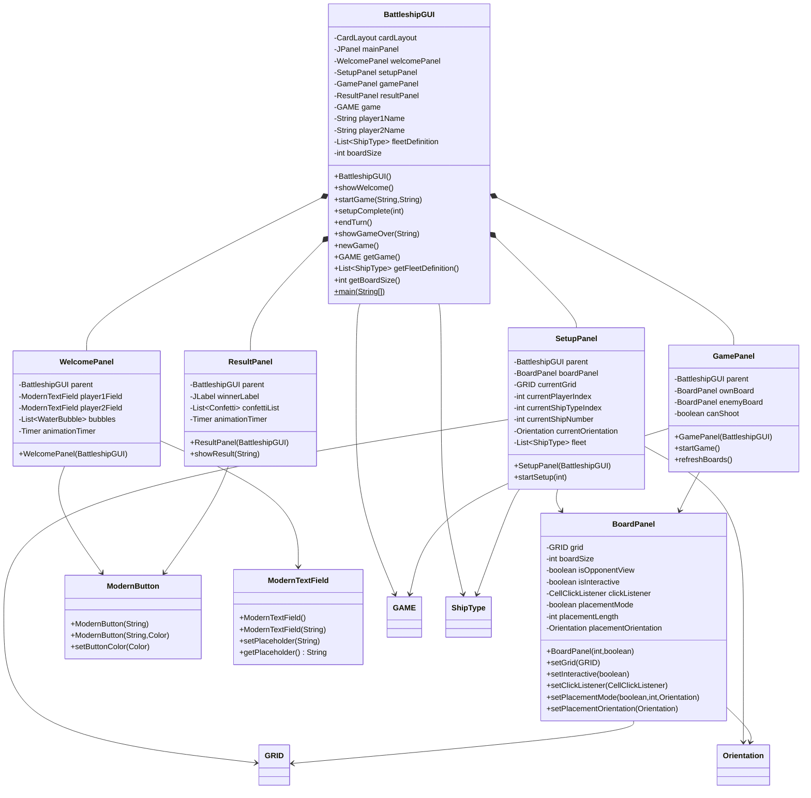
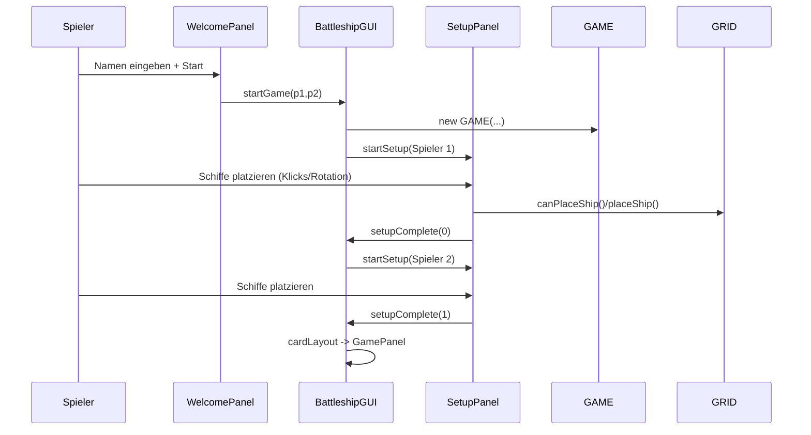
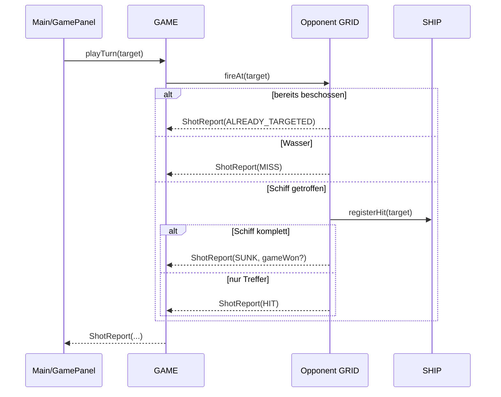

# Schiffe Versenken - Vollstaendige Projektdokumentation

Diese Datei dokumentiert das gesamte Projekt technisch und fachlich:

- Architektur und Schichten
- alle relevanten Klassen
- Klassendiagramme (Mermaid/UML-Style)
- Spielablauf und Datenfluss
- Regeln und Validierungen
- Erweiterbarkeit

---

## 1) Projektueberblick

Das Projekt implementiert **Schiffe Versenken** in zwei Oberflaechen:

- **Konsole** (`Main`)
- **Swing GUI** (`BattleshipGUI` mit mehreren Panels)

Beide Oberflaechen greifen auf dieselbe Spiellogik zu:

- `GAME` (Match/Spielzustand)
- `GRID` (Spielbrett je Spieler)
- `SHIP` (ein Schiff)
- weitere Value-Objekte/Enums (`Coordinate`, `ShipType`, `ShotReport`, ...)

Damit sind UI und Spiellogik sauber getrennt.

---

## 2) Startpunkte und Laufvarianten

### Konsolenmodus

- Einstieg: `Main.main(String[] args)`
- Kompilieren: `javac *.java`
- Start: `java Main`

### GUI-Modus

- Einstieg: `BattleshipGUI.main(String[] args)`
- Kompilieren: `javac *.java`
- Start: `java BattleshipGUI`

---

## 3) Architektur (High-Level)

Das System ist logisch in 3 Bereiche aufteilbar:

1. **Domain / Engine**: Regeln, Zustand, Trefferlogik
2. **UI (Konsole + Swing Panels)**: Interaktion, Darstellung, Eingaben
3. **UI-Widgets**: visuelle Komponenten (`ModernButton`, `ModernTextField`)

### Uebersicht als Klassendiagramm

---

## 4) Detaillierte Klassendiagramme

## 4.1 Engine / Domain

## 4.2 GUI / Praesentationsschicht

---

## 5) Klassen im Detail (fachlich + technisch)

## 5.1 `GAME` - Match-Controller

**Aufgabe**

- Haltet beide Spielerbretter
- Verwaltet aktiven Spieler
- Prueft Spielende/Gewinner

**Wichtigste Verantwortung**

- `playTurn(Coordinate)` delegiert Schuss auf Gegner-`GRID`
- setzt bei Sieg `gameOver = true` und `winnerName`
- `switchTurn()` schaltet zwischen Spieler 0/1

**Beziehung**

- Komponiert genau zwei `GRID`-Objekte
- nutzt `ShipType` als unveraenderbare Flottendefinition fuer Setup

---

## 5.2 `GRID` - Spielfeld und Regelkern

**Aufgabe**

- Speichert Schiffe, Schuesse, Treffercounter
- validiert Schiffplatzierung
- wertet Schuesse aus

**Datenstrukturen**

- `shipIndexAtCell[row][col]`: 0 = kein Schiff, sonst 1-basierter Index in `ships`
- `shotsTaken[row][col]`: ob Koordinate bereits beschossen
- `placedShipCells`/`hitShipCells`: schnelle Siegpruefung ohne jede Runde alle Schiffe zu traversieren

**Regeln in `canPlaceShip`**

- Schiff muss im Board liegen
- keine Ueberlappung
- kein Beruehren anderer Schiffe, auch diagonal (`hasAdjacentShip`)

**Schusslogik in `fireAt`**

- bereits beschossen -> `ALREADY_TARGETED`
- Wasser -> `MISS`
- Schiff getroffen:
  - Schiff nicht komplett -> `HIT`
  - Schiff komplett -> `SUNK`, plus `gameWon` falls alle Schiffzellen getroffen

---

## 5.3 `SHIP` - Ein einzelnes Schiff

**Aufgabe**

- kennt Name + belegte Koordinaten
- speichert Trefferstatus je Segment (`boolean[] hits`)

**Methoden**

- `occupies(Coordinate)` prueft, ob Koordinate zum Schiff gehoert
- `registerHit(Coordinate)` setzt passendes Treffersegment
- `isSunk()` true, wenn alle Segmente getroffen

---

## 5.4 `Coordinate` - Value Object fuer Spielfeldkoordinate

**Eigenschaften**

- immutable (`final` Felder)
- Gleichheit ueber `equals/hashCode` auf `row` und `column`

**Parsing**

- `A1`-Format (Buchstabe + Zahl)
- `1,1`-Format (Zeile,Spalte)
- beide werden 0-basiert intern gespeichert

**Gueltigkeit**

- `validateBounds(...)` erzwingt Boardgrenzen (2..26, Koordinate innerhalb)

---

## 5.5 `ShipType` - Flottendefinition

Beschreibt einen Schiffstyp als Konfiguration:

- `name` (z. B. "U-Boot")
- `length` (Laenge in Zellen)
- `count` (Anzahl dieses Typs)

Diese Klasse ist ebenfalls immutable.

---

## 5.6 `ShotResult` und `ShotReport`

`ShotResult` ist Enum mit 4 moeglichen Ergebnissen:

- `MISS`, `HIT`, `SUNK`, `ALREADY_TARGETED`

`ShotReport` ist das Transportobjekt fuer ein Ergebnis:

- Ergebnisart
- Zielkoordinate
- Name des versenkten Schiffs (falls relevant)
- `gameWon` Flag (bei finalem Treffer)

---

## 5.7 `Orientation`

Enum fuer Schiffausrichtung:

- `HORIZONTAL`
- `VERTICAL`

`parse(...)` akzeptiert:

- `H` / `HORIZONTAL`
- `V` / `VERTICAL`

---

## 5.8 `Main` - Konsolen-Frontend

**Aufgabe**

- Benutzerfuehrung ueber `Scanner`
- Setup (manuell oder random)
- Spielrunde in Schleife bis `game.isGameOver()`

**Wichtige Schritte**

1. Namen lesen
2. Standardflotte erzeugen
3. pro Spieler Setup
4. Zug fuer Zug Schuesse
5. Ausgabe des Gewinners

---

## 5.9 `BattleshipGUI` - GUI-App-Controller

**Aufgabe**

- JFrame + `CardLayout` fuer Screenwechsel
- Zentrale Steuerung zwischen:
  - `WelcomePanel`
  - `SetupPanel`
  - `GamePanel`
  - `ResultPanel`

**Lifecycle**

- `showWelcome()` zeigt Startscreen
- `startGame(...)` erstellt neue `GAME`-Instanz und startet Setup
- `setupComplete(...)` steuert Uebergang von Spieler 1 zu Spieler 2 und dann ins Match
- `showGameOver(...)` zeigt Ergebnisbildschirm

---

## 5.10 `WelcomePanel`

**Aufgabe**

- Spielernameingabe
- visuelles Intro (Wellen/Bubbles Animation)

**Interaktion**

- Start-Button oder Enter startet via `parent.startGame(...)`

---

## 5.11 `SetupPanel`

**Aufgabe**

- interaktives Platzieren der Flotte fuer den aktuellen Spieler

**Kernlogik**

- arbeitet schrittweise mit `currentShipTypeIndex` + `currentShipNumber`
- Klick auf Board -> versucht `currentGrid.placeShip(...)`
- bei Erfolg wird zum naechsten Schiff weitergeschaltet
- `placeRandomly()` platziert komplette Flotte automatisch

**UX**

- Rotieren per Button oder Taste `R`
- visuelle Schiffsliste mit Status (platziert / aktuell / offen)

---

## 5.12 `GamePanel`

**Aufgabe**

- zeigt eigenes und gegnerisches Feld
- verarbeitet Schussaktionen des aktiven Spielers

**Zugregeln in der GUI**

- bei `MISS`: Zugende-Button erscheint, danach `switchTurn()`
- bei `HIT`: Spieler darf weiterschiessen
- bei `SUNK`: ebenfalls weiterschiessen, ausser Spielende

**Spielende**

- wenn `ShotReport.isGameWon()` true, ruft Panel am Ende `parent.showGameOver(...)`

---

## 5.13 `ResultPanel`

**Aufgabe**

- Siegeranzeige + Konfetti-Animation
- Aktionen:
  - Neues Spiel (`parent.newGame()`)
  - Beenden (`System.exit(0)`)

---

## 5.14 `BoardPanel`

**Aufgabe**

- gemeinsame Zeichenkomponente fuer Setup und Match
- kann als eigenes Feld oder Gegnerfeld arbeiten

**Darstellung**

- Wasser, Schiff, Treffer, Fehlschuss, versenktes Schiff
- Hover-Effekte
- Label A-J / 1-10

**Interaktivitaet**

- optional clickbar (`setInteractive(true)`)
- liefert Zelle per `CellClickListener`
- im Setup: Placement-Preview in Gruen/Rot je nach Gueltigkeit

---

## 5.15 `ModernButton` und `ModernTextField`

**`ModernButton`**

- custom gezeichneter Button mit:
  - Farbverlauf
  - Hover-/Press-Animation
  - Schatten + Highlight

**`ModernTextField`**

- custom Textfeld mit:
  - Platzhaltertext
  - Fokusrahmen
  - eigener Hintergrund/Borderrendering

---

## 6) Ablaufdiagramme (Spielprozesse)

## 6.1 Setup-Phase (GUI)

## 6.2 Schussphase (Engine-zentriert)

---

## 7) Regelwerk im Code (implizite Spielregeln)

1. Brettgroesse zwischen **2 und 26**
2. Schifflaenge mindestens **2**
3. Schiffanzahl pro Typ mindestens **1**
4. Schiffe duerfen:
   - nicht ueberlappen
   - sich nicht beruehren (auch nicht diagonal)
5. Doppelschuss auf gleiche Zelle liefert `ALREADY_TARGETED`
6. Sieg, wenn alle belegten Schiffzellen getroffen wurden

---

## 8) Konsolen- und GUI-Variante im Vergleich

- **Gemeinsam**: Domain (`GAME`, `GRID`, `SHIP`, ...)
- **Unterschiedlich**: Input/Output, Darstellung, Flow-Steuerung

Vorteil:

- Spiellogik ist wiederverwendbar
- neue Oberflaechen (z. B. JavaFX, Web-Backend) koennen auf Domain aufsetzen

---

## 9) Technische Besonderheiten und Hinweise

- Keine Packages: alle Klassen liegen aktuell im Default Package
- GUI nutzt stark custom painting (Swing `paintComponent`)
- GUI enthaelt mehrere kleine Innere Klassen fuer Animation:
  - `WelcomePanel.WaterBubble`
  - `ResultPanel.Confetti`

Empfehlung bei Weiterentwicklung:

- mittelfristig in Packages aufteilen (`domain`, `ui.console`, `ui.swing`, `ui.components`)
- Unit-Tests fuer Domain-Klassen (insb. `GRID`-Regeln) ergänzen

---

## 10) Erweiterungsideen

1. KI-Gegner (einfach/mittel/schwer)
2. Konfigurierbare Flotte und Brettgroesse im GUI
3. Speichern/Laden von Spielstaenden
4. Soundeffekte und optionale Animationstoggles
5. Netzwerkmodus (Client/Server)

---

## 11) Datei- und Klassenverzeichnis (Referenz)

- `Main.java`
- `BattleshipGUI.java`
- `WelcomePanel.java`
- `SetupPanel.java`
- `GamePanel.java`
- `ResultPanel.java`
- `BoardPanel.java`
- `GAME.java`
- `GRID.java`
- `SHIP.java`
- `Coordinate.java`
- `ShipType.java`
- `Orientation.java`
- `ShotResult.java`
- `ShotReport.java`
- `ModernButton.java`
- `ModernTextField.java`

---

Wenn du willst, kann ich im naechsten Schritt auch noch eine zweite Datei mit **nur UML-Diagrammen** erzeugen (kompakt fuer Praesentation/Abgabe).
